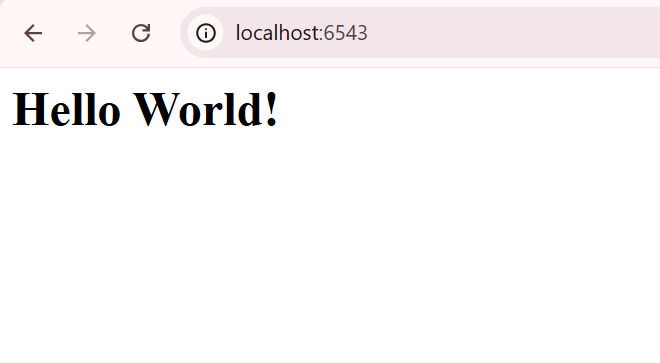

Percobaan "Hello World" dalam framework Pyramid berfungsi sebagai pengantar padat yang mendemonstrasikan konsep inti melalui aplikasi file tunggal. Inti dari percobaan ini adalah pemisahan peran antara WSGI Server dan WSGI Application. Server, dalam hal ini waitress, bertugas menangani koneksi jaringan dan request HTTP yang masuk, kemudian meneruskannya ke objek aplikasi WSGI yang dibuat oleh Pyramid. Objek aplikasi ini dibangun menggunakan Configurator, yang merupakan komponen sentral Pyramid. Melalui Configurator, kita secara eksplisit mendefinisikan struktur aplikasi: pertama, kita menggunakan config.add_route('hello', '/') untuk memetakan URL path dasar (/) ke nama rute internal; kedua, kita menggunakan config.add_view(hello_world, route_name='hello') untuk mengaitkan rute tersebut dengan fungsi hello_world. Fungsi hello_world, yang disebut sebagai View Callable, adalah tempat logika bisnis aplikasi berada; fungsi ini menerima objek request yang berisi data permintaan dan wajib mengembalikan objek Response Pyramid yang kemudian diubah menjadi respons HTTP standar yang dikirim kembali ke browser pengguna. Dengan demikian, percobaan ini mengajarkan pola dasar Pyramid: request masuk dicocokkan dengan Route, memicu eksekusi View, yang menghasilkan Response, menegaskan filosofi Pyramid mengenai konfigurasi yang eksplisit dan terperinci.

Tampilan di localhost : 
 