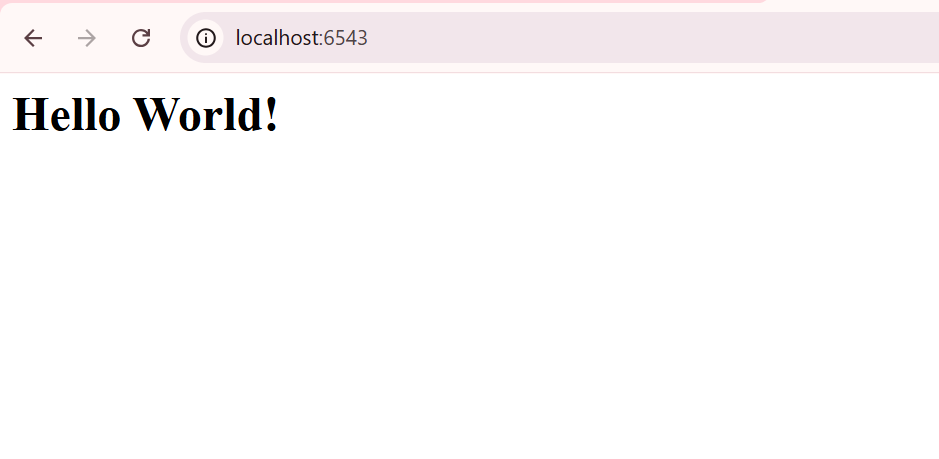

# Struktur "Package" Python

Tutorial ini berfokus pada cara mengubah skrip Python tunggal menjadi struktur proyek yang standar dan profesional. Intinya, kita berhenti memperlakukan kode kita sebagai *skrip*, dan mulai memperlakukannya sebagai *paket* (package) yang bisa di-install.

-----

## 🎯 Objektif (Tujuan Utama)

  * **Skalabilitas:** Mempersiapkan proyek agar bisa jadi besar. Kita nggak mungkin menyimpan 50 *view* dalam satu file, kan? Ini adalah fondasi untuk memecah file nanti.
  * **Standarisasi:** Ini adalah cara "resmi" developer Python menyusun proyek.
  * **Manajemen Dependensi:** Mengenalkan `setup.py` sebagai pusat informasi proyek, terutama daftar paket lain yang kita butuhkan (seperti `pyramid` dan `waitress`).

-----

## 🚀 Cara Menjalankan (Windows)

Berikut adalah cara yang benar untuk menjalankan proyek ini di terminal PowerShell (asumsi Anda ada di folder proyek utama).

1.  **Aktifkan venv (jika belum):**

    ```powershell
    ..\venv\Scripts\Activate.ps1
    ```

2.  **Install Proyek (Sangat Penting\!):**
    Perintah ini "mendaftarkan" proyek Anda ke *virtual environment*.

    ```powershell
    pip install -e .
    ```

3.  **Jalankan Aplikasi:**

    ```powershell
    python tutorial/app.py
    ```

4.  **Buka di Browser:**
    Buka `http://localhost:6543/`

-----

## 🔬 Anatomi Perubahan (Analisis Mendalam)

Kita sekarang punya struktur yang rapi:

### 1\. Struktur Folder Baru

Kita sekarang punya:

```
package/
├── setup.py           <-- BARU
├── tutorial/          <-- BARU
│   ├── __init__.py    <-- BARU (meski kosong)
│   └── app.py         <-- Kode lama kita pindah ke sini
└── venv/
```

  * `package/`: Ini folder *proyek* kita.
  * `tutorial/`: Ini folder *paket* Python kita. Nama inilah yang akan kita `import`.

### 2\. File `setup.py`

File `setup.py` adalah "Kartu Tanda Penduduk" proyek kita. Ini memberi tahu `pip` (manajer paket Python) semua tentang proyek kita.

```python
from setuptools import setup

requires = [
    'pyramid',
    'waitress',
]

setup(
    name='tutorial',
    install_requires=requires,
)
```

  * **Analisis `name='tutorial'`:** Ini adalah nama "resmi" paket kita saat di-install.
  * **Analisis `install_requires`:** Ini adalah kuncinya. Kita mendaftar semua *dependensi* proyek kita. Saat orang lain (atau server kita) meng-install proyek ini, `pip` akan otomatis membaca daftar ini dan meng-install `pyramid` dan `waitress` untuk kita. Ini jauh lebih baik daripada memberi tahu orang, "Oh, jangan lupa `pip install pyramid` dulu ya...".

### 3\. Folder `tutorial/` & `__init__.py`

Kenapa kodenya dipindah ke `tutorial/app.py`?

  * Dengan membuat folder `tutorial` dan meletakkan file `__init__.py` di dalamnya (meskipun kosong), kita memberi tahu Python: "Hei, folder `tutorial` ini bukan folder biasa. Ini adalah **paket Python**."
  * Ini berarti kita (atau kode lain) sekarang bisa melakukan `import tutorial` atau `from tutorial import ...`. Ini mustahil dilakukan jika hanya berupa file `app.py`.

### 4\. Perintah `pip install -e .`

Ini adalah perintah paling penting di langkah ini. Mari kita bedah:

  * `pip install`: Perintah standar untuk meng-install paket.
  * `.` (titik): Berarti "install paket yang ada di direktori ini" (dia akan mencari `setup.py`).
  * `-e` atau `--editable`: Ini adalah "Mode Pengembang" (Development Mode).

**Analisis `-e`:**
Tanpa `-e`, `pip` akan *menyalin* kode kita ke folder `site-packages` di dalam `venv`. Artinya, jika kita mengedit `tutorial/app.py`, perubahannya **tidak akan terlihat** karena aplikasi akan menjalankan *salinannya*.

Dengan `-e`, `pip` tidak menyalin file. Sebaliknya, ia membuat **"jembatan" (symlink)** dari `site-packages` langsung ke folder `tutorial` kita.

> **Keuntungannya:** Kita bisa mengedit file `tutorial/app.py`, menyimpan, dan perubahan itu **langsung aktif** saat *request* berikutnya masuk (atau saat server di-restart). Ini adalah *workflow* standar untuk pengembangan.

### 5\. Cara Menjalankan yang "Aneh"

Tutorial ini meminta kita menjalankan:
`$VENV/bin/python tutorial/app.py`

**Analisis:**
Ini sebenarnya cara yang **aneh dan tidak standar**. Kita baru saja repot-repot *meng-install* paket `tutorial` kita, tapi kita malah menjalankannya seolah-olah itu adalah *skrip* biasa.

**Lalu kenapa tutorialnya begitu?**
Ini hanyalah **langkah transisi**. Tutorial ini ingin menunjukkan satu perubahan pada satu waktu. Kita sudah belajar cara membuat paket. Di langkah *selanjutnya*, kita akan belajar cara menjalankan aplikasi ini "dengan benar" menggunakan *entry point* (seperti `pserve`), yang bergantung pada fakta bahwa paket kita *sudah ter-install*.

-----

## 🏁 Kesimpulan Analisis

Langkah ini adalah fondasi mutlak untuk membangun aplikasi yang sesungguhnya.

Dengan beralih ke "proyek terstruktur" (package), keuntungan terbesarnya adalah skalabilitas (kita bisa memecah kode jadi banyak file) dan manajemen dependensi (kita punya setup.py untuk mengelola apa saja yang dibutuhkan proyek kita).

Perintah pip install -e . adalah workflow utama yang akan kita gunakan terus-menerus selama pengembangan.

Tampilan di localhost :

