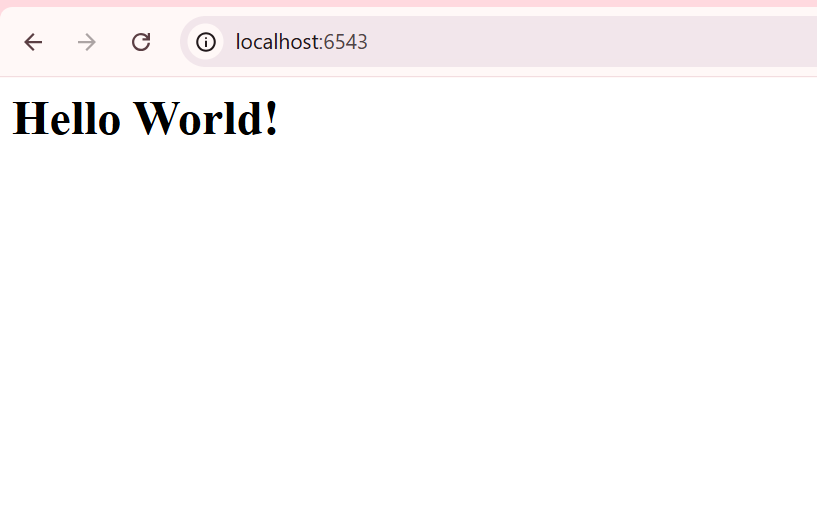

# Konfigurasi `.ini` & `pserve`

Dokumen ini menganalisis pendekatan standar industri untuk menjalankan aplikasi Pyramid menggunakan *runner* (`pserve`) dan file konfigurasi eksternal (`.ini`).

Inti dari pendekatan ini adalah **memisahkan Kode (logika) dari Konfigurasi (pengaturan)**.

-----

## 🎯 Objektif (Tujuan Utama)

  * **Pemisahan Konfigurasi:** Memindahkan pengaturan "yang bisa berubah" (seperti port server) keluar dari kode Python ke file `.ini`.
  * **Standarisasi Server:** Berhenti menjalankan server secara manual. Kita akan menggunakan `pserve`, *runner* standar Pyramid yang tahu cara membaca file `.ini`.
  * **Memperkenalkan *Entry Points*:** Belajar bagaimana `setup.py` bisa "memberi tahu" `pserve` di mana menemukan fungsi utama aplikasi kita.
  * **Pola *App Factory*:** Mengubah kode kita dari skrip yang berjalan menjadi "pabrik" (fungsi `main`) yang *membuat* dan *mengembalikan* objek aplikasi WSGI.

-----

## 🚀 Cara Menjalankan (Windows)

Cara kita menjalankan aplikasi ini menggunakan `pserve` dan file `.ini`.

1.  **Aktifkan venv (jika belum):**

    ```powershell
    # Asumsi Anda ada di folder proyek
    ..\venv\Scripts\Activate.ps1
    ```

2.  **Install Proyek Anda:**
    Perintah ini membaca `setup.py` dan meng-install paket dalam mode *editable*, mendaftarkan *entry point* yang kita butuhkan.

    ```powershell
    (venv) PS C:\...> pip install -e .
    ```

3.  **Jalankan Server (Cara Baru):**
    Kita tidak lagi memanggil `python`. Kita menggunakan `pserve` dan menunjuk ke file konfigurasi kita.

    ```powershell
    (venv) PS C:\...> pserve development.ini
    ```

    > **💡 Tips Pro:** Gunakan `--reload` agar server otomatis *restart* setiap kali Anda menyimpan perubahan pada file `.py`\!

    > ```powershell
    > pserve development.ini --reload
    > ```

4.  **Hentikan Server:**
    Tekan **Ctrl + C** di terminal.

-----

## 🔬 Anatomi Proyek (Analisis Mendalam)

Mari kita bedah tiga file utama yang membentuk proyek ini dan kenapa mereka penting.

### 1\. `development.ini` (File Konfigurasi)

Ini adalah "Panel Kontrol" aplikasi kita. File `.ini` adalah file teks sederhana untuk menyimpan pengaturan.

```ini
[app:main]
use = egg:tutorial#main

[server:main]
use = egg:waitress#main
host = 0.0.0.0
port = 6543
```

  * **Analisis `[server:main]`:**

      * Ini adalah pengaturan untuk **Server**. Kita memberi tahu `pserve` untuk menggunakan `waitress` (`use = egg:waitress#main`).
      * Kita memindahkan `host` dan `port` dari kode Python kita ke sini. Ini adalah poin utamanya. Sekarang, jika kita ingin menjalankan di port `8000` di server produksi, kita tinggal mengedit file `.ini` ini, tanpa menyentuh kode Python sama sekali.

  * **Analisis `[app:main]`:**

      * Ini adalah pengaturan untuk **Aplikasi** kita.
      * Baris `use = egg:tutorial#main` adalah "lem" yang ajaib. Ini memberi tahu `pserve`: "Untuk aplikasi bernama 'main', cari paket yang ter-install (`egg`) bernama `tutorial` dan temukan *entry point* yang juga bernama `main`."

-----

### 2\. `setup.py` (File "Peta" Proyek)

Bagaimana `pserve` tahu *entry point* `main` itu apa? Jawabannya ada di `setup.py`. Kita menambahkan bagian `entry_points`.

```python
# ... (kode impor) ...
setup(
    name='tutorial',
    # ... (install_requires) ...
    entry_points={
        'paste.app_factory': [
            'main = tutorial:main',
        ],
    },
)
```

  * **Analisis `entry_points`:**
      * Ini adalah "Peta" atau "Buku Telepon" yang kita berikan kepada Python saat paket di-install.
      * Kita mendaftarkan sebuah `paste.app_factory` (ini adalah standar yang digunakan `pserve`).
      * Baris `main = tutorial:main` adalah intinya. Ini membuat asosiasi:
          * Nama `main` (yang dicari oleh `development.ini`)
          * Menunjuk ke `tutorial:main`, yang berarti: "Di dalam paket `tutorial`, cari fungsi bernama `main`."

-----

### 3\. `tutorial/__init__.py` (Logika Inti / "App Factory")

Di sinilah letak fungsi `main` yang kita daftarkan di `setup.py`.

```python
from pyramid.config import Configurator
from pyramid.response import Response

def main(global_config, **settings):
    """ This function returns a Pyramid WSGI application.
    """
    with Configurator(settings=settings) as config:
        config.add_route('hello', '/')
        config.add_view(hello_world, route_name='hello')
        return config.make_wsgi_app()

def hello_world(request):
    return Response('<body><h1>Hello World!</h1></body>')
```

  * **Analisis Pola *App Factory*:**
      * Fungsi `main(...)` inilah yang disebut **App Factory** (Pabrik Aplikasi). Tugasnya hanya *membuat* dan *mengembalikan* aplikasi WSGI.
      * Perhatikan apa yang **HILANG**: Tidak ada lagi `if __name__ == '__main__':`\! Tidak ada lagi panggilan `serve(app, ...)`\!
      * **Kenapa?** Karena tugas menjalankan server sekarang 100% ditangani oleh `pserve`. `pserve` akan memanggil fungsi `main` ini, mengambil aplikasi yang di-*return*, dan menyerahkannya ke `waitress` (sesuai konfigurasi di `.ini`).

-----

## 🏁 Kesimpulan Analisis

Langkah ini adalah lompatan besar dari "skrip" menjadi "aplikasi".

Dengan memisahkan konfigurasi ke `.ini`, kita membuat aplikasi kita **fleksibel** dan siap untuk *deployment*. Dengan menggunakan `pserve` dan *entry points*, kita sekarang menggunakan rangkaian alat standar Pyramid, yang membuat pengembangan, *debugging* (dengan `--reload`), dan *deployment* jauh lebih mudah.

Tampilan di localhost :

