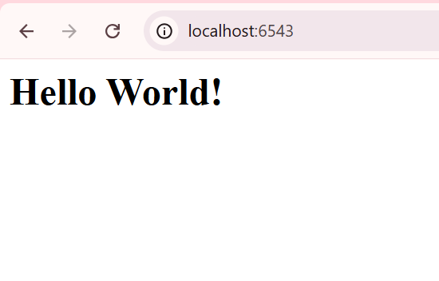

# Produktivitas dengan `pyramid_debugtoolbar`

Dokumen ini menganalisis cara menginstal dan mengonfigurasi `pyramid_debugtoolbar`, sebuah *add-on* (pengaya) Pyramid yang krusial untuk mempermudah proses pengembangan dan *debugging*.

-----

## 🎯 Objektif (Tujuan Utama)

  * **Produktifitas:** Menambahkan alat bantu *debugging* yang canggih langsung di *browser*.
  * **Konsep Add-on:** Memahami bagaimana Pyramid dapat diperluas fungsinya menggunakan paket-paket eksternal.
  * **Konfigurasi Ekstra:** Belajar cara memisahkan dependensi *development* (alat bantu) dari dependensi *production* (yang wajib ada).

-----

## 🚀 Cara Menjalankan (Windows)

1.  **Aktifkan venv (jika belum):**

    ```powershell
    ..\venv\Scripts\Activate.ps1
    ```

2.  **WAJIB: Install Proyek dengan *Extras* `[dev]`:**
    Perintah ini berbeda. Kita memberi tahu `pip` untuk meng-install "ekstra" dependensi yang kita definisikan untuk *development*.

    ```powershell
    (venv) PS C:\...> pip install -e ".[dev]"
    ```

    *(Tanda kutip penting di PowerShell agar `[]` bisa terbaca)*

3.  **Jalankan Server:**
    Sama seperti sebelumnya, gunakan `pserve`.

    ```powershell
    (venv) PS C:\...> pserve development.ini --reload
    ```

4.  **Buka di Browser:**
    Buka `http://localhost:6543/`. Anda akan melihat logo Pyramid `►` muncul di sisi kanan layar. Itulah *debug toolbar*.

-----

## 🔬 Anatomi Perubahan (Analisis Mendalam)

Ada dua file kunci yang kita ubah, dan satu perintah instalasi baru. Mari kita bedah *kenapa*.

### 1\. `setup.py` (Memperkenalkan "Extras")

Kita tidak menambahkan `pyramid_debugtoolbar` ke daftar `requires` utama. Sebaliknya, kita membuat grup baru bernama `extras_require`.

```python
# ... (impor) ...

requires = [
    'pyramid',
    'waitress',
]

dev_requires = [
    'pyramid_debugtoolbar',
]

setup(
    name='tutorial',
    install_requires=requires,
    extras_require={
        'dev': dev_requires,
    },
    entry_points={
    },
)
```

  * **Analisis "Extras":**
    Ini adalah konsep kunci untuk manajemen paket yang profesional.
      * **`install_requires`:** Ini adalah dependensi **minimal** yang dibutuhkan aplikasi Anda untuk *berjalan* di server produksi.
      * **`extras_require`:** Ini adalah dependensi **opsional**. Kita membuat grup bernama `'dev'` yang berisi alat-alat *hanya untuk developer* (seperti *debugger*, *linter*, alat *testing*).
      * **Kenapa?** Server produksi kita tidak perlu *debug toolbar*. Dengan memisahkan ini, kita menjaga lingkungan produksi tetap "bersih", ramping, dan aman, sambil tetap memberikan *tool* canggih kepada *developer* di mesin lokal mereka.

### 2\. Perintah `pip install -e ".[dev]"`

  * **Analisis Perintah:**
      * `pip install -e .` : "Install paket di folder ini (`.`) dalam mode *editable* (`-e`)."
      * `"[dev]"`: "Dan setelah itu, cari grup *extras* bernama `dev` di `setup.py` dan install semua paket di dalamnya."
      * Inilah cara kita meng-install dependensi inti **DAN** dependensi *development* kita dalam satu perintah.

### 3\. `development.ini` (Mengaktifkan "Add-on")

Meng-install paket saja tidak cukup. Kita harus memberi tahu aplikasi Pyramid kita untuk **menggunakannya**.

```ini
[app:main]
use = egg:tutorial#main

pyramid.includes = 
    pyramid_debugtoolbar

[server:main]
```

  * **Analisis `pyramid.includes`:**
      * `pyramid_debugtoolbar` adalah "add-on" Pyramid. Ia tahu cara "berbicara" dengan inti Pyramid.
      * Saat `pserve` membaca file `.ini` ini, ia melihat `pyramid.includes`. `pserve` kemudian memberi tahu `Configurator` Pyramid untuk secara internal menjalankan `config.include('pyramid_debugtoolbar')`.
      * Perintah `include` inilah yang "mengaktifkan" *add-on*, mengizinkannya menambahkan *view* baru, mengubah *template*, dan menyuntikkan *toolbar* ke halaman kita.
      * **Inilah kekuatan file `.ini`:** Untuk menonaktifkan *toolbar* di produksi, kita cukup menghapus baris ini dari file `production.ini` kita. **Tidak perlu mengubah kode Python sama sekali.**

-----

## 🏁 Kesimpulan Analisis

`pyramid_debugtoolbar` adalah contoh sempurna dari **arsitektur Pyramid yang bisa diperluas**.

Kita belajar cara memisahkan dependensi *development* dari *production* menggunakan `extras_require` di `setup.py`.

Yang paling penting, kita belajar bahwa meng-install *add-on* adalah proses dua langkah:

1.  **Install** paketnya (via `pip` dan `setup.py`).
2.  **Aktifkan** paketnya di aplikasi (via `pyramid.includes` di file `.ini`).

Manfaat langsungnya adalah *tool debugging* yang sangat kuat yang muncul langsung di *browser* kita, yang puncaknya adalah **Traceback Interaktif**—jika aplikasi *crash*, kita mendapatkan laporan *error* canggih di *browser* (bukan hanya di terminal) yang memungkinkan kita memeriksa variabel secara *real-time*.

Tampilan di localhost :

