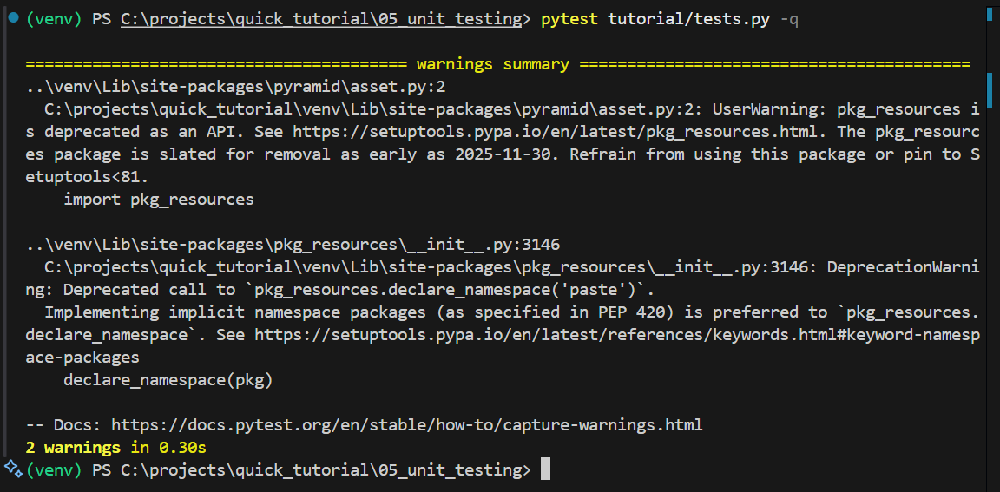

# Unit Testing dengan `pytest`

Dokumen ini menganalisis implementasi *testing* (pengujian) otomatis pada aplikasi web Pyramid. Pengujian adalah pilar fundamental untuk memastikan kualitas kode, mencegah *bug* (regresi) di masa depan, dan memberikan kepercayaan diri saat melakukan *refactoring* atau menambah fitur.

Kita akan menggunakan `pytest`, *test runner* paling populer di ekosistem Python, untuk menjalankan dua jenis tes: *Unit Test* dan *Functional Test*.

-----

## Objektif (Tujuan Utama)

  * **Kualitas Kode:** Menulis tes otomatis untuk memvalidasi logika aplikasi kita.
  * **Membedakan Jenis Tes:** Memahami perbedaan krusial antara *Unit Test* (menguji satu fungsi) dan *Functional Test* (menguji keseluruhan alur aplikasi).
  * **Manajemen Dependensi Tes:** Belajar memisahkan dependensi *testing* (`pytest`, `webtest`) dari dependensi inti aplikasi menggunakan `extras_require`.
  * **Pengenalan `pytest`:** Belajar cara menjalankan tes dan menggunakan fitur inti `pytest` seperti *fixtures*.

-----

## Cara Menjalankan Tes (Windows)

1.  **Aktifkan venv (jika belum):**

    ```powershell
    ..\venv\Scripts\Activate.ps1
    ```

2.  **WAJIB: Install Dependensi Tes:**
    Kita perlu meng-install `pytest` dan `webtest`. Kita lakukan ini menggunakan *extras* `[test]` yang kita definisikan di `setup.py`.

    ```powershell
    (venv) PS C:\...> pip install -e ".[test]"
    ```

    *(Tanda kutip `"` penting di PowerShell agar `[]` bisa terbaca).*

3.  **Jalankan Semua Tes:**
    `pytest` akan secara otomatis menemukan semua file tes (yang berawalan `test_` atau akhiran `_test.py`) di dalam folder `tests/` dan menjalankannya.

    ```powershell
    (venv) PS C:\...> pytest
    ```

    Anda akan melihat *output* yang menunjukkan berapa banyak tes yang lulus (`.`) atau gagal (`F`).

-----

## Anatomi Tes

### 1\. Persiapan: `setup.py` dan Folder `tests/`

Sebelum bisa menguji, kita perlu dua hal:

  * **`setup.py` (Modifikasi):**
    Kita menambahkan grup *extras* baru bernama `'test'`. Ini adalah praktik terbaik untuk memisahkan dependensi.

    ```python
    test_requires = [
        'pytest',
        'webtest',
    ]

    setup(
        extras_require={
            'dev': dev_requires,  
            'test': test_requires, 
        },
    )
    ```

    **Analisis:** Sama seperti `[dev]` (untuk *debugtoolbar*), `[test]` memisahkan alat bantu *testing* dari kode produksi. Server produksi tidak perlu menjalankan `pytest`, jadi kita tidak memasukkannya ke `install_requires`.

  * **Folder `tests/`:**
    Ini adalah konvensi standar Python. `pytest` secara otomatis mencari tes di dalam folder ini.

### 2\. Analisis Unit Test (`tests/test_views.py`)

*Unit test* menguji satu "unit" (sepotong kode) secara terisolasi. Dalam kasus ini, kita menguji fungsi *view* `hello_world` secara langsung.

```python
from tutorial.views import hello_world # Impor fungsi yang mau di-tes

def test_hello_world_view():
    # 1. Setup: Buat request palsu
    request = DummyRequest() 
    
    # 2. Eksekusi: Panggil fungsi
    response = hello_world(request)
    
    # 3. Validasi: Cek hasilnya
    assert response.body == b'<body><h1>Hello World!</h1></body>'
    assert response.status_code == 200
```

  * **Analisis Kunci:**
      * **Isolasi:** Tes ini **tidak** menjalankan server, **tidak** peduli soal *routing*, dan **tidak** peduli soal `pserve` atau `.ini`.
      * **Cepat:** Karena sangat terisolasi, tes ini berjalan sangat cepat.
      * **`DummyRequest`:** Kita menggunakan `DummyRequest` yang disediakan Pyramid untuk "memalsukan" objek *request* yang dibutuhkan oleh fungsi *view*.
      * **Asersi:** Kita langsung memeriksa `response.body` dan `response.status_code` dari objek `Response` yang dikembalikan oleh fungsi.
      * **Analogi:** Ini seperti mengeluarkan mesin mobil dan mengujinya di atas meja lab, tanpa peduli dengan roda atau setirnya.

### 3\. Analisis Functional Test (`tests/test_functional.py`)

*Functional test* (atau *integration test*) menguji keseluruhan alur aplikasi. Apakah *routing* berfungsi? Apakah *view* dipanggil dengan benar? Apakah semuanya terhubung?

```python
import pytest
import webtest

# 1. Setup (Fixture): Membuat "pabrik" aplikasi palsu
@pytest.fixture
def testapp():
    from tutorial import main # Impor "pabrik" aplikasi kita
    app = main({}, **{})
    return webtest.TestApp(app)

# 2. Tes: Menjalankan aplikasi palsu
def test_root(testapp):
    # 3. Eksekusi: Buat request HTTP palsu ke URL '/'
    res = testapp.get('/', status=200) 
    
    # 4. Validasi: Cek apa yang ada di body HTML
    assert b'Hello World!' in res.body 
```

  * **Analisis Kunci:**
      * **Integrasi:** Tes ini **memuat seluruh aplikasi** kita (`main({}, **{})`). Ia menguji *routing* (`/`), eksekusi *view*, dan respons HTTP sekaligus.
      * **`webtest`:** Kita menggunakan `webtest.TestApp` untuk "membungkus" aplikasi WSGI kita. `webtest` menyediakan *tool* untuk membuat *request* HTTP palsu (seperti `.get()`) seolah-olah kita adalah *browser*.
      * **`@pytest.fixture` (Fixture):**
        Fungsi `testapp()` adalah sebuah *fixture*. Ini adalah fungsi *setup* canggih dari `pytest`. `pytest` akan menjalankannya secara otomatis dan "menyuntikkan" hasilnya (objek `TestApp`) sebagai argumen ke setiap fungsi tes yang membutuhkannya (seperti `test_root(testapp)`).
      * **Asersi:** Kita tidak lagi memeriksa `response.body == ...`. Kita memeriksa `b'Hello World!' in res.body`, karena respons `webtest` adalah simulasi HTML yang lengkap.
      * **Analogi:** Ini seperti duduk di dalam mobil yang sudah dirakit lengkap, menyalakan mesin, menginjak gas, dan memeriksa apakah mobilnya benar-benar maju.

-----

## Kesimpulan Analisis

Kita sekarang memiliki dua jaring pengaman untuk aplikasi kita:

1.  **Unit Tests:** Memastikan setiap fungsi individu (seperti *view*) melakukan tugasnya dengan benar secara terisolasi.
2.  **Functional Tests:** Memastikan semua bagian aplikasi (konfigurasi, *routing*, *view*) terhubung dan bekerja sama sebagaimana mestinya.

Pyramid (dengan pola *app factory*-nya) dan `pytest` (dengan *fixtures*-nya) membuat kedua jenis pengujian ini sangat mudah diatur dan dijalankan.

---

## Tampilan di localhost :

