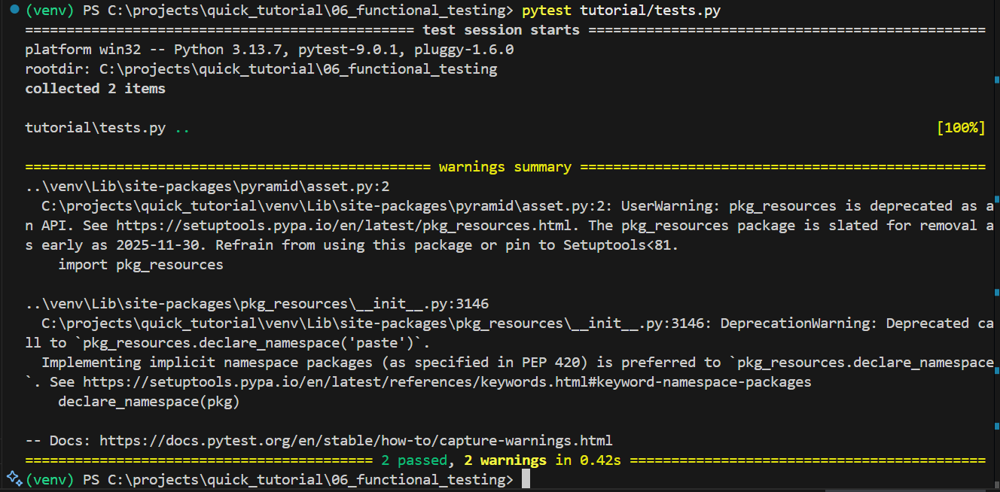

# *Functional Testing* (Pengujian Fungsional)

Dokumen ini menganalisis implementasi **Pengujian Fungsional**. Berbeda dengan *Unit Test* yang menguji fungsi secara terisolasi, *Functional Test* menguji aplikasi kita secara **keseluruhan**, seolah-olah ada *browser* yang mengaksesnya.

Ini adalah pengujian "black box": kita tidak peduli dengan logika internal; kita hanya peduli apakah *request* ke URL tertentu memberikan *respons* yang benar.

-----

## 🎯 Objektif (Tujuan Utama)

  * **Validasi Alur Kerja:** Memastikan semua komponen (rute, *view*, konfigurasi) terhubung dan bekerja sama dengan benar.
  * **Simulasi *Browser*:** Menggunakan `webtest` untuk "memalsukan" *request* HTTP (seperti `GET` dan `POST`) ke aplikasi kita.
  * **Keyakinan *Deployment*:** Memberikan keyakinan tinggi bahwa aplikasi yang sudah dirakit akan berfungsi seperti yang diharapkan saat di-*deploy*.

-----

## 🚀 Cara Menjalankan Tes (Windows)

1.  **Aktifkan venv (jika belum):**

    ```powershell
    ..\venv\Scripts\Activate.ps1
    ```

2.  **WAJIB: Install Dependensi Tes:**
    Kita perlu meng-install `webtest`. Kita lakukan ini menggunakan *extras* `[test]` yang kita definisikan di `setup.py`.

    ```powershell
    (venv) PS C:\...> pip install -e ".[test]"
    ```

    *(Tanda kutip `"` penting di PowerShell agar `[]` bisa terbaca).*

3.  **Jalankan Semua Tes:**
    `pytest` akan secara otomatis menemukan semua file tes (termasuk yang baru kita buat) dan menjalankannya.

    ```powershell
    (venv) PS C:\...> pytest
    ```

-----

## 🔬 Anatomi Proyek

Mari kita bedah tiga komponen utama yang membuat pengujian fungsional ini bekerja.

### 1\. `setup.py` (Menambah `webtest`)

Pertama, kita perlu alat baru. `webtest` adalah alat bantu utama di sini.

```python
# ...
test_requires = [
    'pytest',
    'webtest',  
]

setup(
    # ...
    extras_require={
        'dev': dev_requires,
        'test': test_requires,
    },
    # ...
)
```

  * **Analisis:** Kita menambahkan `webtest` ke daftar dependensi *testing* (`test_requires`). `webtest` adalah "browser palsu" super cepat. Ia bisa mengirim *request* HTTP ke aplikasi WSGI kita secara langsung, tanpa perlu menjalankan server `pserve` atau membuka *browser* sungguhan. Ini membuat tes kita cepat dan andal.

-----

### 2\. `tests.py` (Modifikasi): Memperkenalkan *Fixture*

Ini adalah bagian paling penting. Kita menambahkan "pabrik tes" ke file `tests.py` kita.

```python
import pytest
import webtest

# FUNCTIONAL TEST
@pytest.fixture
def testapp():
    """Fixture untuk membuat aplikasi WebTest."""
    from tutorial import main # 1. Impor "pabrik" aplikasi kita
    app = main({}, **{})     # 2. Buat aplikasi WSGI-nya
    
    # 3. Bungkus aplikasi dengan 'browser palsu' WebTest
    return webtest.TestApp(app) 
```

  * **Analisis `@pytest.fixture`:**
      * `@pytest.fixture` adalah dekorator canggih dari `pytest` untuk fungsi *setup*.
      * Fungsi `testapp()` ini sekarang adalah **"fixture"**. `pytest` akan secara otomatis menjalankan fungsi ini *sebelum* menjalankan tes apa pun yang memintanya.
      * **Apa yang dilakukannya?**
        1.  Ia mengimpor fungsi `main` asli dari `tutorial/__init__.py` (si "pabrik" aplikasi kita).
        2.  Ia menjalankan `main()` untuk **merakit seluruh aplikasi Pyramid kita** (rute, *view*, dll).
        3.  Ia membungkus aplikasi `app` yang sudah jadi itu dengan `webtest.TestApp`, dan mengembalikan "browser palsu" yang siap digunakan.

-----

### 3\. `tests.py` (Modifikasi): Tes Fungsional

Sekarang kita menggunakan *fixture* `testapp` tadi untuk menulis tes yang sesungguhnya.

```python
# ... (setelah fixture testapp) ...

def test_root(testapp):
    """Tes fungsional untuk me-request URL root."""
    
    # 'testapp' di sini adalah hasil return dari fixture di atas
    
    # 1. Kirim request GET palsu ke '/'
    res = testapp.get('/', status=200)
    
    # 2. Periksa apakah respons body-nya benar
    assert b'Hello World!' in res.body
```

  * **Analisis Tes `test_root`:**
      * **Injeksi Fixture:** Perhatikan parameter `testapp`. `pytest` secara ajaib "menyuntikkan" hasil dari *fixture* `testapp` ke dalam argumen fungsi tes ini.
      * **`testapp.get('/', status=200)`:** Ini adalah inti dari tes fungsional.
          * Kita **tidak** memanggil fungsi `hello_world` secara langsung.
          * Kita **mensimulasikan** *browser* yang mengirimkan *request* HTTP `GET` ke URL `/`.
          * `status=200` adalah asersi: kita mengharapkan *request* ini berhasil (HTTP 200 OK).
      * **`assert b'Hello World!' in res.body`:** Kita memeriksa *output* HTTP mentah (`res.body`) yang dikirim kembali. Kita memastikan bahwa teks `Hello World!` (sebagai `bytes`) benar-benar ada di dalam respons HTML.

-----

## 🏁 Kesimpulan Analisis

**Kenapa ini jauh lebih baik dari *Unit Test*?**

*Unit test* kita sebelumnya membuktikan bahwa fungsi `hello_world` bekerja. Tapi itu **tidak** membuktikan:

  * Apakah rute `/` sudah terdaftar?
  * Apakah rute `/` sudah terhubung ke *view* `hello_world`?

*Functional test* ini menguji **keseluruhan rantai** dalam satu kali jalan. Jika tes ini lulus, kita 100% yakin bahwa jika seseorang membuka `http://localhost:6543/` di *browser* asli, mereka akan melihat "Hello World\!".

Tampilan di localhost :

